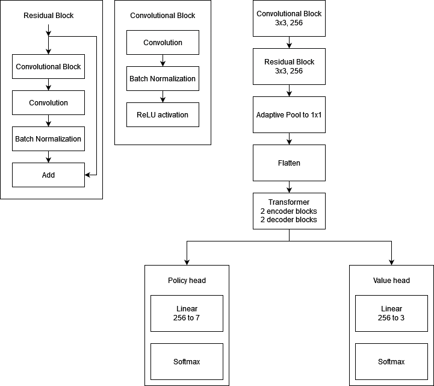
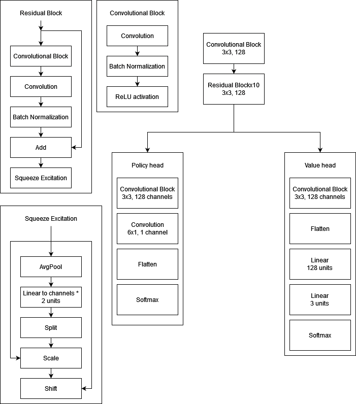

# Application of Attention in AlphaZero algorithm

A project comparing two policy networks architectures on the game "Connect Four."

## Installation

Install `Node.js` and `Python 3.11`. Then install all dependicies by running

```bash
pip install -r connect-four/attention/requirements.txt
```

To use the web UI, navigate into the `client` folder and run

```bash
npm install
```

And then:

```bash
npm run build
```

to build the client. To launch the application run

```bash
python app.py
```

App script loads the `model.pt` weights. To train the model from the scratch, run the `train.py` script.

## Model topologies

### With attention layers



### Pure convolution



## Background

In 2018, the paper "Mastering Chess and Shogi by Self-Play with a General Reinforcement Learning Algorithm" by David Silver et al [1]. was released, in which superhuman level of play in various games, such as Go and chess was achieved using neural networks paired with self-play. In 2017, the paper "Attention is all you need" [2] introduced the concept of self-attention which was since then used to achieve state of the art results in various fields, such as computer vision [3] and natural language processing [4]. This project aims to gauge if incorporating attention layers into the network topology can improve the performance of the model.

## Experiments and results

While matched against each other, network using the attention layers won the match with the score +18=2-0. It is worth noting that all the drawn games the attention model did not have the advantage of the first move. This result suggest the elo rating advantage of about 400 points, with 95% confidence interval being [202, 770].

## References

[1] D. Silver, T. Hubert, J. Schrittwieser, I. Antonoglou, M. Lai, A. Guez,
M. Lanctot, L. Sifre, D. Kumaran, T. Graepel et al., “A general rein-
forcement learning algorithm that masters chess, shogi, and go through
self-play,” Science, vol. 362, no. 6419, pp. 1140–1144, 2018.

[2] A. Vaswani, N. Shazeer, N. Parmar, J. Uszkoreit, L. Jones, A. N.
Gomez, L. Kaiser, and I. Polosukhin, “Attention is all you need,” 2017.
[Online]. Available: [https://arxiv.org/pdf/1706.03762.pdf](https://arxiv.org/pdf/1706.03762.pdf)

[3] X. Chen, C. Liang, D. Huang, E. Real, K. Wang, Y. Liu, H. Pham,
X. Dong, T. Luong, C.-J. Hsieh, Y. Lu, and Q. V. Le, “Symbolic discovery
of optimization algorithms,” 2023.

[4] S. Takase and S. Kiyono, “Lessons on parameter
sharing across layers in
transformers,” 2022.
